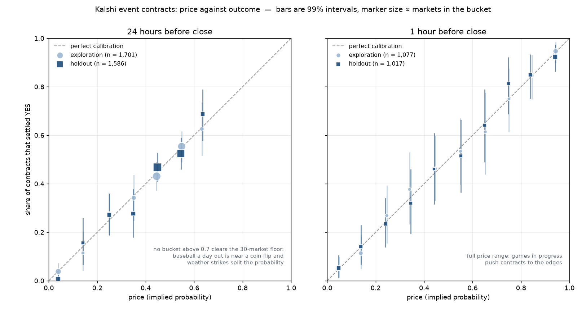

# Are prediction-market prices calibrated — and is the error big enough to trade?

A pre-registered measurement on **3,287 settled Kalshi event contracts** (sports and weather), priced from the
exchange's own hourly candles 24 hours and 1 hour before close, with the design frozen before any result was
computed and a holdout opened exactly once.

**Headline:** a day before close, Kalshi sports contracts are calibrated — deviation **+0.05 pp**, 99% CI
[−0.01, +0.10]. Weather contracts are slightly overpriced, **−0.75 pp**, 99% CI [−0.88, −0.60], confirmed out of
sample. But **0.75 pp is smaller than the cost of taking it**: half the quoted spread is ~0.8 cent and Kalshi's
taker fee at a 20-cent price rounds up to 2 cents. The pre-registered trading rule (H3) returned **+0.79% of
collateral, 99% CI [−2.00, +2.61]** — not distinguishable from zero. The bias is real and untradable.

No investment advice follows from this work.

---

## Why this question

An event contract pays $1 if the event happens and $0 if it does not, so its price *is* a probability statement.
That makes it the rare market where calibration can be tested with no model of the underlying events at all:
line up every settled contract that traded at 30 cents and count how many settled YES.

It is also a clean test of the thing a trader actually cares about. Finding a bias is easy. Finding one larger
than the spread plus the fee is the whole job — which is why H3 exists and is tested at the quoted bid, never at
the mid.

## Data

Public REST API, no account and no key ([`download.py`](download.py)):

| Endpoint | What it gives |
|---|---|
| `/trade-api/v2/markets?series_ticker=…&status=settled` | settled markets with the resolved outcome and volume |
| `/trade-api/v2/series/{s}/markets/{t}/candlesticks` | hourly candles: best bid, best ask, traded price, volume, open interest |

Eight series fixed in advance: **KXMLBGAME, KXNFLGAME, KXEPLGAME, KXUCLWGAME, KXNHLGAME** (game winners) and
**KXHIGHNY, KXHIGHCHI, KXHIGHLAX** (daily high temperature). Everything the API returned for them was used.

One settled market = one observation, priced from the hourly candle ending closest to the horizon (±90 minutes).
Eligibility, fixed in advance: resolved yes/no, two-sided quote, spread ≤ 10 cents, volume ≥ 100 contracts.
Price = the mid, rounded to the cent. 5,381 observations, 2,778 in exploration and 2,603 in the holdout.

The raw download is 87 MB and is not committed; `download.py` rebuilds it and
[`data/manifest.json`](data/manifest.json) holds the sha256 and byte size of every file.

## Method

Everything below was written down in [PREREGISTRATION.md](PREREGISTRATION.md) **before the first number existed**.

- **Split by event, not by market.** Two contracts on the same game share an outcome, so the halves are drawn by
  `sha1("kalshi-calibration-2026-09-23" + event_ticker)`, last byte odd → exploration, even → holdout.
- **The holdout is read once.** `analysis.py holdout --one-look` refuses to run twice and writes a timestamped
  lock file ([`outputs/holdout/LOCK`](outputs/holdout/LOCK): 2026-09-23T00:51:49Z).
- **Inference:** two-sided, p < 0.01, 10,000-resample bootstrap clustered by event, seed 20260923.
- **Costs stated in advance:** execution at the quoted side, taker fee `0.07 · p · (1 − p)` rounded up to the
  next cent, collateral of `1 − p` tied up until settlement, returns per dollar of collateral.

Three hypotheses: **H1** prices equal settlement rates; **H2** contracts priced ≤ 0.10 settle YES less often than
their price implies (the longshot bias confirmed out of sample in my football study); **H3** selling those
contracts at the bid and holding to settlement makes money after fees.

## Result



Holdout half — 1,586 markets over 635 events at 24 hours, 1,017 over 492 events at 1 hour:

| | 24 hours before close | 1 hour before close |
|---|---|---|
| Brier score | **0.2003** vs 0.2399 for a constant forecast | **0.1435** vs 0.2495 |
| H1 calibration | rejected: −0.18 pp, CI [−0.25, −0.11] | **not rejected**: −0.01 pp, CI [−0.27, +0.23] |
| H2 longshot bias (≤ 0.10) | not confirmed: −2.46 pp, CI [−4.18, +0.12] | not confirmed: +1.40 pp, CI [−2.96, +6.60] |
| H3 tradability after fees | not confirmed: +0.79% of collateral, CI [−2.00, +2.61] | not confirmed: −3.29%, CI [−8.90, +1.39] |

The rejection of H1 at 24 hours is not "Kalshi is miscalibrated". The pooled average mixes two different kinds of
market, and splitting them (descriptive, added before the holdout was opened, printed for both halves) shows
where it comes from:

| Group | n (holdout) | mean price | settled YES | deviation | 99% CI | exploration |
|---|---|---|---|---|---|---|
| sports | 1,126 | 0.477 | 0.478 | **+0.05 pp** | [−0.01, +0.10] | +0.09 pp |
| weather | 460 | 0.216 | 0.209 | **−0.75 pp** | [−0.88, −0.60] | −0.82 pp |

Sports contracts come in pairs — one per team — and the two mids sum to 0.9986, so that group is calibrated by
construction *and* in fact. Weather markets are sets of 3–6 mutually exclusive temperature strikes, most of them
cheap, and those legs settle YES slightly less often than their price implies. Both halves agree on the sign and
the size, which is the point of holding half the data back.

### Why the bias does not become a trade

At a price of 0.20, on one contract:

| Item | Cents |
|---|---|
| mispricing found | 0.75 |
| half the quoted spread (mean spread 1.53 c) | 0.77 |
| taker fee `0.07 · 0.2 · 0.8 = 1.12`, **rounded up** | 2.00 |

The rounding alone is larger than the edge. H3 tests exactly this and comes back indistinguishable from zero in
both halves and at both horizons — the same shape of conclusion as my football study, where the bookmaker margin
swallowed a real favourite–longshot bias.

## What this does not cover

1. The public API returns roughly two months of settled markets: a snapshot, not a history.
2. Sports and weather only. Politics, macro and the Fed series are not in the sample.
3. **At 24 hours the sample barely reaches above a price of 0.7** (0.7–0.8: 21 markets, 0.8–0.9: 8, 0.9–1.0: 2),
   so seven of ten buckets clear the 30-market floor. This is not a filter artifact — of 401 MLB candles at the
   horizon, zero were dropped for `ask ≥ 1` and only 6 had a bid above 0.7. A baseball game a day out is close to
   a coin flip, and a day's high temperature has to land in one of several buckets. Heavy favourites are covered
   only at the 1-hour horizon, where the full price range appears.
4. Hourly candles hide what happened inside the hour, so the quote used is an approximation of what a trader saw.
5. Settlement is taken as correct; disputed resolutions are not modelled.

## Reproduce

```
python download.py                      # rebuilds data/raw (~87 MB), writes data/manifest.json
python analysis.py exploration          # half A
python analysis.py holdout --one-look   # half B, once; refuses if outputs/holdout/LOCK exists
python make_figure.py                   # outputs/calibration.png
```

Standard library only, except matplotlib for the figure. [`outputs/exploration/NOTES.md`](outputs/exploration/NOTES.md)
is the write-up finished before the holdout was opened, including what I said I expected to see.

## Related

- [football-market-efficiency](https://github.com/urajimiruliss-arch/football-market-efficiency) — the same
  protocol on ~23,500 football matches.
- [crypto-basis-carry](https://github.com/urajimiruliss-arch/crypto-basis-carry) — pre-registered measurement of
  the delta-neutral basis trade.
- [allocation-benchmarks](https://github.com/urajimiruliss-arch/allocation-benchmarks) — volatility targeting
  against buy-and-hold.
